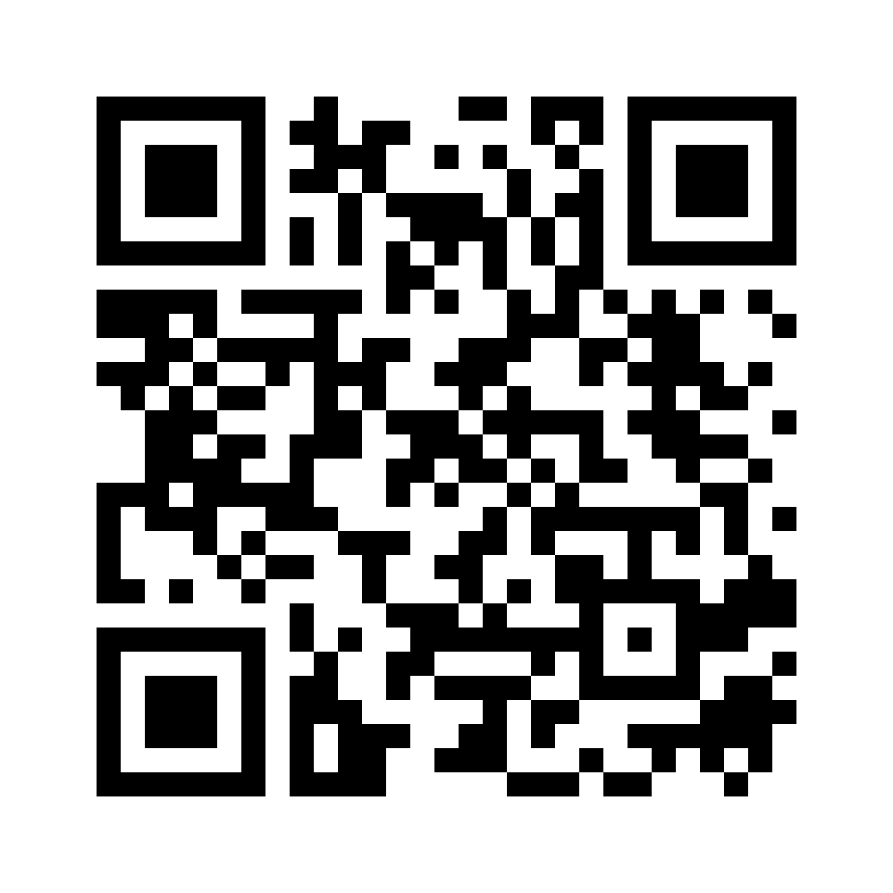

<!--
============================================================
  掲示板用のお知らせ / Notice for the building noticeboard
  print/notice-board.md

  印刷する前に、＿＿＿ の部分をご記入ください：
    1. お部屋番号
    2. お電話番号（掲示板は建物内なので、記載しても安全です）
    3. カーテンの枚数・色・サイズ
    4. 引き取り日（決まっていれば）

  いらない部分は削除してかまいません。
  最後の English 欄も、必要なければ削除してください。

  Before printing, fill in the ＿＿＿ blanks: room number, phone
  number, curtain details. Delete anything you don't need,
  including the English section at the end.
============================================================
-->

# さよならセール

## 会津若松を離れます。家のものをお譲りします

ご近所の皆さま、はじめまして。

私たちは**ヴィクトル、ベロニカ、マーク、エミリア**の4人家族です。
10年間お世話になった会津若松を離れ、8月末に1年間ヨーロッパへ移ります。

そのため、家にあるものを**お安く、または無料で**お譲りしたいと思っています。
捨ててしまうより、近くにお住まいの方に使っていただけたら嬉しいです。

> ### 先着順です。ご希望の品がありましたら、お気軽にお声がけください。
>
> **同じ建物の方には、お部屋までお運びします。**
> お盆の期間中の引き取りも可能です。お値段もご相談に応じます。

---

## ◆ カーテン

このマンションはどのお部屋も窓の高さが同じですので、
そのままお使いいただけると思います。

| 品物 | お値段 | お渡し |
|---|---|---|
| カーテン ＿＿組（＿＿＿色 / 幅＿＿×丈＿＿cm） | 無料 | すぐ |

---

## ◆ 家電・キッチン用品

| 品物 | お値段 | お渡し |
|---|---|---|
| ドラム式洗濯機　アイリスオーヤマ 7.5kg | 17,000円 | 8月25日から |
| プリンター　エプソン EP-810AB（コピー・スキャンもできます） | 15,000円 | すぐ |
| 電動ポット　象印 CD-WY30　3.0L（保温98/90/70℃） | 1,200円 | すぐ |
| ドライヤー　テスコム ione | 1,000円 | すぐ |
| ハンドブレンダー　ブラウン MQ 500 | 500円 | すぐ |
| プラスチック引き出しケース　2台（幅55×奥行40×高さ77cm） | 無料 | すぐ |
| プラスチックの収納ケース・カゴ　たくさんあります | 無料 | すぐ |
| クッション　4個 | 無料 | すぐ |

---

## ◆ お車

| 品物 | お値段 | お渡し |
|---|---|---|
| トヨタ　クラウン ロイヤルサルーン　平成17年　3.0 | 150,000円 | 8月28日から |

走行 156,432km／**車検は令和10年4月26日まで有効**（次の車検費用はかかりません）／
自動車税など納付済み／本革シート・純正ナビ・オートマ

---

## ◆ 子ども用品

お子さん・お孫さんのいらっしゃるお宅へ。写真はウェブサイトでご覧いただけます。

| 品物 | お値段 | お渡し |
|---|---|---|
| ベビーカー＋チャイルドシート＋ISOFIXベース（ジョイー 3点セット） | 22,000円 | すぐ |
| トイハウスラック（おもちゃ箱＋本棚）　2台 | 2,000円 / 1,500円 | 8月25日から |
| ベビーベッド　2台（内寸120×70cm　お布団・カバー付き） | 無料 | 8月25日から |
| すべり台つき ジャングルジム | 無料 | すぐ |
| 子ども用テーブル＋ベンチ（裏返すとおままごとキッチンに） | 500円 | すぐ |
| チャイルドシート　2台（コンビ 回転式／ビーセーフ） | 各 500円 | 8月28日から |
| キックスケーター　3輪（オクセロ B1　2歳から） | 500円 | すぐ |
| 音の出るパズル　4点（メリッサ＆ダグ） | 300〜400円 | すぐ |

---

## 写真はウェブサイトでご覧いただけます

<table>
<tr>
<td></td>
<td>

### khaustova.me/sayonara-sale

スマートフォンのカメラでQRコードを読み取るか、
上のアドレスを入力してください。

**品物は随時追加しています**ので、
ときどきご覧いただけると嬉しいです。

</td>
</tr>
</table>

---

## ご連絡方法

QRコードやインターネットをお使いにならなくても大丈夫です。
下記のいずれでもご連絡いただけます。

- **＿＿＿号室**　直接ドアをノックしてください。いつでもかまいません
- **お電話　＿＿＿＿＿＿＿＿＿＿＿**
- **LINE**　ウェブサイトに追加用のQRコードがあります

どの品物も、ご相談やご質問だけでもお気軽にどうぞ。
重いものは、私たちがお部屋までお持ちします。

10年間、本当にありがとうございました。

**ヴィクトル・ベロニカ・マーク・エミリア**

---
---

<!-- ↓ 外国の方がいらっしゃらない場合は、ここから下を削除してください -->

## In English

We are Victor, Veronica, Mark and Emilia. After ten wonderful years in
Aizuwakamatsu we are moving to Europe for a year at the end of August, so we are
selling and giving away everything in our home.

**First come, first served.** Prices are negotiable, collection during Obon is
possible, and **we will carry things to your door if you live in this building.**

Photos and the full list: **khaustova.me/sayonara-sale** — updated regularly.

To reach us: knock at **room ＿＿＿**, call **＿＿＿＿＿＿＿＿**, or message us on
LINE (QR code on the website).

Thank you for ten happy years here.
